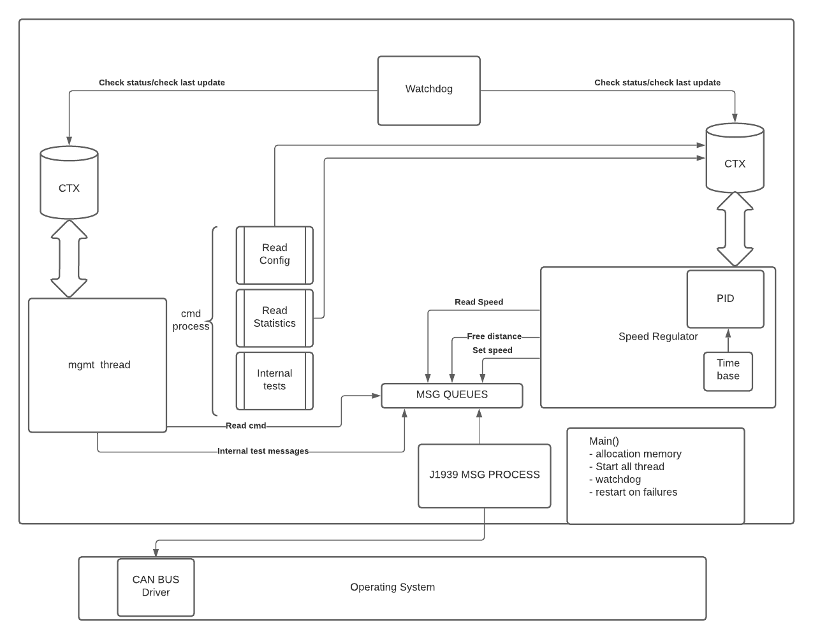

# Table of contents
1. [Overview](#over)
1. [Speed regulation](#speed)
   1. [Architecture](#arch)
1. [Testing and design for tests](#test)
1. [operating system](#os)
   1. [Configuration](#config)

# Overview <a name = "over"/>
## Preambule
This project is assuming the following premisses:
1. Speed regulation will be adaptive. Therefore front free distance mesurement will be available. 
1. Three motor types will be available. Pick-ups does have diesel and gasoline motors. Ford is also planning hybrid véhicule in a near future. 
1. The security in important and therefore tests and error detections are key features. 
## Speed regulation <a name = "speed"/>
The driver must bring the vehicle up to speed manually and use a button to set the cruise control to the current speed. If the speed regulation is adaptative the speed must be reduced when the free distance in front of the véhicule fall below and critical distance. 
# Regulator design
We will need to design a PI or PID to get a smouth and precise speed control. To do that efficiently we will need to avaluate the transfer function of the speed mesurement and the transfert fonction of the acceleration of the complete véhicule. This will need to worked closely with the client. We can probably do that with monitored driving tests. In order to debug and test the software integration in the early stages of devellopment we can be starting by ON/OFF speed control versions of the module. This will allow to debug, tests and improve the robustness of the software during the same time we are working the PID design. 

## Architecture 
Here some architecture overview

# Testing and design for tests
As testing this design inside a vehicule will not be easy we will need to spend some time on testing infrastructure and debugging features.
## Internal api for test
J1939 does content a lot of provision application defined messages. Some to them should be kept for nxxo inc internal use. 
1. Internal Statistics and Configurations reading. 
1. Start/Stop and extract results of internal verification tests. 
 
# Security and quality
When unexpected conditions is detected we must be deactivating the accelaration control, réintilisate all contexts and return in a state that the speed control product is ready to use. 
## Watchdog
The design of the watchdog will depend greatly of the selected hardware and operating systems. ( linux, freeRtos, or bare metal application )
## Build machine and regressions tests
Every new features, and commits must verified by automated sanity checks. New features should be integrated in repository with some basic sanity tests. 
## Coverage
Depending of the level of quality we wish to produce we should think to add code coverage tools in our testing methodology. This would help to ensure that all execptional condition are covered during the automated regression tests. 

# OS Selection  
We need to be evaluating the number of mips needed. This need to be done with the Hardware team. 
## Bare metal 
Using no OS. This can be increasing the software development time, as we need to develop and/or adapt all the software for that particular hardware. Doing so may allow to reduce the CPU and memory size needed for the design and therefore the final hardware cost. This may be suitable for large scale production. 
## Linux 
Using Linux.  We Can use linux with a bigger CPU. This can be reducing development time as several librairies and drivers can be availale. The GPL and LGPL licnesing needs to be taken into account. 
## FreeRTOS ( or equivalent )
Using lighweight compile-time configurable operating systems maybe a good compromise for several applications. 

# J1939 overview
CAN (Controller Area Network ) bus which is ISO 11898, is usually the physical layer used for J1939.
## Can bus driver, and J1939 interface librairy.
The main application will be accessing the J1939 messages from a **msg queues** that are managed by a J1939 library. 
TBD: 
1. Is this librairy must thread safe ?
1. Can Bus inside Linux may simpler  https://elinux.org/CAN_Bus
1. FreeRTOS seems to contain support for can bus messaging. 

